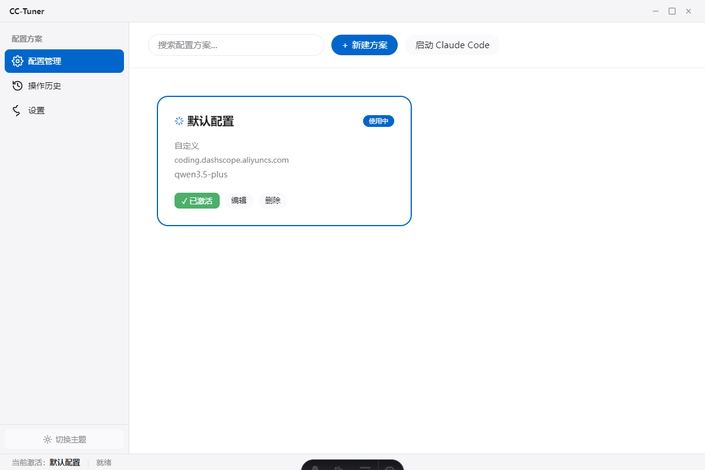
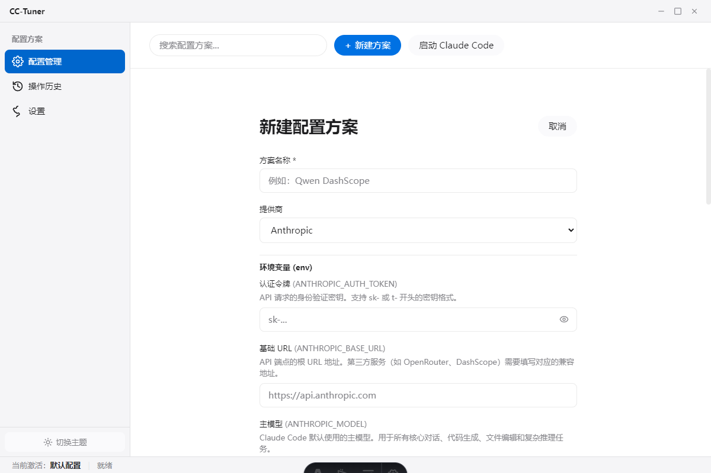
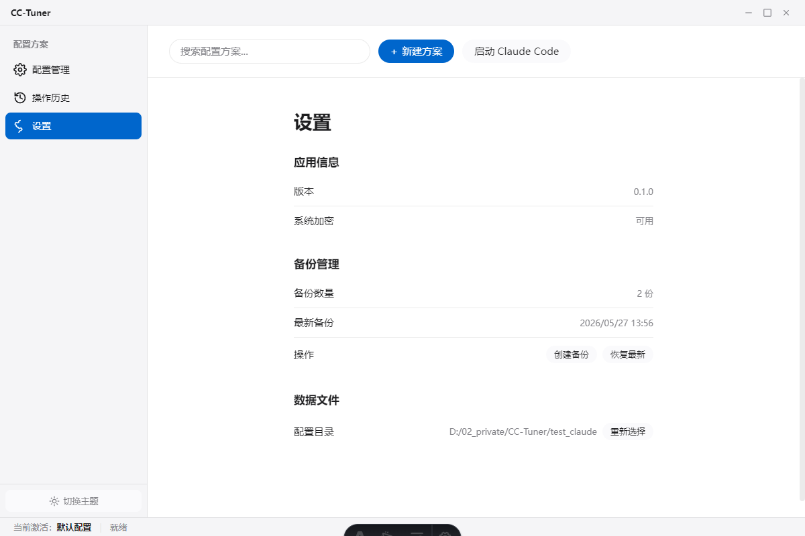
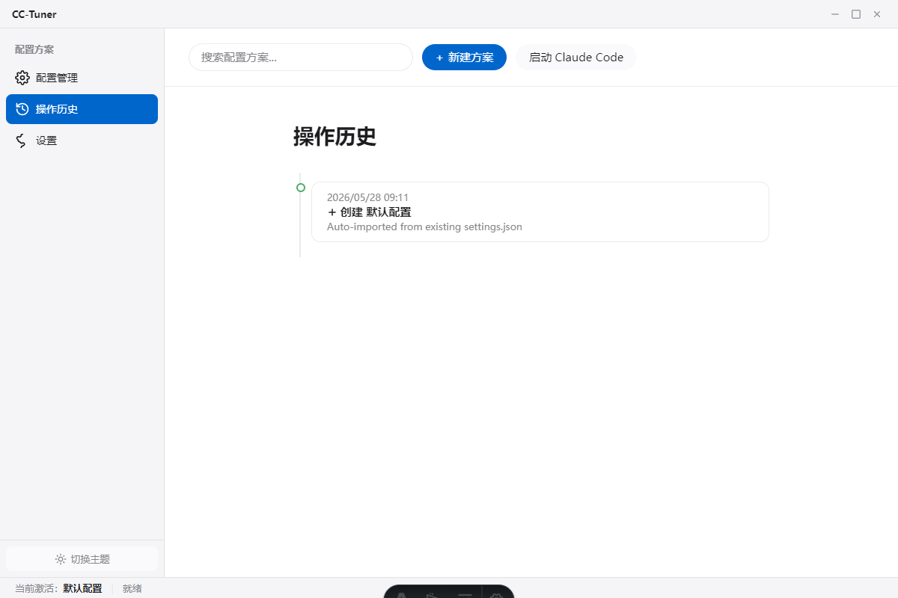

# CC-Tuner

Claude Code 模型切换桌面工具。支持管理多个模型配置方案，在 Anthropic 官方 API、OpenRouter、DeepSeek、Ollama、vLLM 等提供商之间快速切换。

## 界面预览

| 配置管理 | 新建/编辑方案 |
|---|---|
|  |  |

| 设置 | 操作历史 |
|---|---|
|  |  |

## 功能特性

- **配置目录选择** — 启动时引导选择 `.claude/` 所在项目目录，CC-Tuner 管理该目录下的 `settings.json`
- **多方案管理** — 创建、编辑、删除模型配置方案，支持 8 个 `ANTHROPIC_*` 环境变量完整配置
- **一键切换** — 切换方案时自动写入 `settings.json`，保留 `enabledPlugins` 等其他字段
- **自动导入** — 首次配置后自动读取已有 `settings.json` 的 env 字段，生成初始方案
- **连通性测试** — 发送测试请求到 API 端点验证连通性
- **安全存储** — API Key 使用操作系统级加密（DPAPI on Windows / Keychain on macOS）存储
- **自动备份** — 切换前自动备份 settings.json，支持查看和恢复备份
- **操作历史** — 记录每次创建、编辑、切换、删除操作的时间线和内容
- **暗色主题** — 支持明暗主题手动切换
- **窗口控制** — 自定义标题栏，支持最小化、最大化/还原、关闭

## 快速开始

### 环境要求

| 工具 | 版本 |
|---|---|
| Node.js | ≥ 20 LTS |
| npm | ≥ 10 |

### 安装依赖

```bash
npm install
```

### 开发模式

```bash
npm run dev          # 启动 Astro 开发服务器 + Electron 窗口
```

### 构建

```bash
npm run build        # Astro 构建 + TypeScript 编译
npm run package:win  # 打包 Windows exe（release/cc-tuner-win32-x64/）
```

### 测试

```bash
npm test             # 运行单元测试（Vitest, 54 个用例）
npm run test:watch   # 监听模式
npm run typecheck    # TypeScript 类型检查
```

## 技术栈

| 层 | 技术 |
|---|---|
| 桌面框架 | Electron 28 |
| 前端 | Astro 4 + 原生 JS（无框架） |
| 样式 | CSS Custom Properties（Apple Design System） |
| 图标 | Lucide-style inline SVG（2px 描边圆角） |
| 主进程语言 | TypeScript |
| 打包 | @electron/packager |
| 测试 | Vitest + MSW |

## 首次使用

1. 启动 CC-Tuner 后，弹窗提示选择**配置目录**（包含 `.claude/settings.json` 的项目根目录）
2. 如已有 `settings.json` 且包含 env 配置，自动创建"默认配置"方案
3. 点击「新建方案」创建更多配置
4. 点击卡片上的「切换」激活方案，自动写入 `settings.json`

## 项目结构

```
cc-tuner/
├── electron/                  # Electron 主进程 (TypeScript)
│   ├── main.ts               # 入口，窗口管理，IPC 注册
│   ├── preload.ts            # contextBridge 安全桥接
│   ├── services/             # 核心服务
│   │   ├── config-manager.ts   # settings.json 读写
│   │   ├── profile-manager.ts  # Profile CRUD
│   │   ├── security.ts         # API Key 加密/解密
│   │   ├── validator.ts        # API 连通性测试
│   │   ├── backup-manager.ts   # 自动备份/恢复
│   │   ├── history-manager.ts  # 操作历史记录
│   │   ├── shell-service.ts    # Claude Code 终端启动
│   │   └── settings-store.ts   # 应用设置持久化
│   └── ipc/                  # IPC channel handlers
├── src/                      # 渲染进程 (Astro + Vanilla JS)
│   ├── pages/
│   │   └── index.astro       # 单页 HTML shell
│   ├── js/                   # 原生 JS 模块
│   │   ├── app.js             # 入口，事件绑定
│   │   ├── api.js             # IPC 通信封装
│   │   ├── renderers.js       # DOM 渲染引擎
│   │   ├── state.js           # 简易 pub/sub 状态管理
│   │   ├── providers.js       # Provider 常量和图标
│   │   ├── theme.js           # 主题切换
│   │   └── toaster.js         # Toast 通知
│   ├── styles/
│   │   ├── tokens.css         # Design tokens
│   │   └── globals.css        # 全局样式
│   └── astro.config.mjs
├── public/js/                # 静态 JS（构建时同步自 src/js/）
├── scripts/
│   └── package-win.mjs       # Windows 打包脚本
├── tests/unit/               # 单元测试 (54 个用例)
├── docs/                     # 开发文档 (12 篇)
├── screenshots/              # 界面截图
└── package.json
```

## 数据存储

| 文件 | 位置 | 内容 |
|---|---|---|
| `settings.json` | 用户指定的配置目录 | Claude Code 配置（读写目标） |
| `profiles.json` | `AppData/Roaming/cc-tuner/` | CC-Tuner 方案列表 |
| `app-settings.json` | `AppData/Roaming/cc-tuner/` | 应用设置（配置目录路径） |
| `cc-tuner-history.json` | `AppData/Roaming/cc-tuner/` | 操作历史记录 |
| `backups/` | `AppData/Roaming/cc-tuner/backups/` | settings.json 自动备份 |

## 开发文档

完整开发文档见 [docs/README.md](docs/README.md)：

| 文档 | 内容 |
|---|---|
| [01-overview](docs/01-overview.md) | 项目背景、功能需求、术语表 |
| [02-architecture](docs/02-architecture.md) | 系统架构、技术选型、目录结构 |
| [03-data-models](docs/03-data-models.md) | Profile、Provider、AppState 数据模型 |
| [04-services](docs/04-services.md) | 核心服务层设计 |
| [05-ipc-spec](docs/05-ipc-spec.md) | IPC 通道定义、preload 接口 |
| [06-ui-guide](docs/06-ui-guide.md) | 组件树、设计系统 |
| [07-security](docs/07-security.md) | 加密方案、安全策略 |
| [08-testing](docs/08-testing.md) | 测试策略、Vitest 配置 |
| [09-build-deploy](docs/09-build-deploy.md) | 构建流程、打包配置 |
| [10-exception-handling](docs/10-exception-handling.md) | 错误码、异常处理、UI 反馈 |
| [12-build](docs/12-build.md) | Electron 打包指南与白屏避坑 |

## 安全说明

- API Key 使用 Electron `safeStorage` 加密存储（DPAPI/Keychain/libsecret）
- 解密的明文 API Key 仅在发送测试请求时使用，请求完成后丢弃
- 渲染进程通过 `contextBridge` 与主进程通信，不直接访问 Node.js API
- 仅管理 `settings.json` 的 `env` 字段，不影响 `enabledPlugins` 等其他配置
